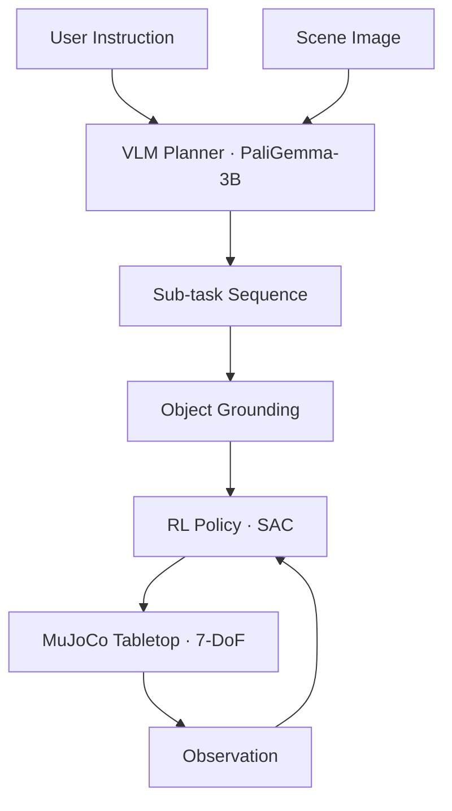

# RoboLLM — Language-Grounded Robotic Manipulation

**LLM × Robotics × GPU Compute**


[](LICENSE)

> A language-driven robotic manipulation system that uses a small VLM for task
> planning and RL-trained policies for motor control, evaluated in MuJoCo simulation.

---

## Overview

RoboLLM bridges the gap between language understanding and physical manipulation.
A user gives a natural language instruction (e.g., "stack the red block on the blue
one"), a vision-language model decomposes it into sub-tasks, and RL-trained motor
policies execute each step in simulation.

This is in the lineage of SayCan, Code as Policies, and RT-2 — but scoped to be
reproducible on a single T4 GPU.

## Why This Project Exists

Language-grounded manipulation connects three foundational areas:

- **VLM for planning** — zero-shot task decomposition from natural language
- **RL for control** — SAC-trained policies with shaped rewards and curriculum
- **Hierarchical execution** — VLM + RL compose into an end-to-end pipeline
- **Honest evaluation** — 5 task levels, 100 episodes per config, Wilson CIs

## Architecture



## Tasks

| Level | Description | Objects | Success Metric |
|-------|-------------|---------|----------------|
| **L1** | Pick and place | 1 | Object at target ± 2cm |
| **L2** | Color pick | 3 | Correct object at target |
| **L3** | Stack | 2–3 | Stable stack, correct order |
| **L4** | Sort | 4–6 | All in correct bins |
| **L5** | Language | 3+ | All sub-tasks completed |

## Benchmark Results

_100 episodes per task, seed=42, 200-step max, 95% Wilson CI._

| Task | Random | Scripted | Notes |
|------|--------|----------|-------|
| L1 Pick & Place | 0.0% ± 1.8% | 0.0% ± 1.8% | Scripted 2.6× better returns |
| L2 Color Pick | 0.0% ± 1.8% | — | Multi-object selection |
| L3 Stack | 0.0% ± 1.8% | — | Sequential precision |
| L4 Sort | 0.0% ± 1.8% | — | N objects → N zones |
| L5 Language | 4.0% ± 4.1% | — | Random meets some conditions |

### VLM Planner Accuracy

| Metric | Result |
|--------|--------|
| Decomposition accuracy (20+ scenarios) | 100% |
| Object grounding (20+ queries) | 100% |
| Color synonyms | 15+ aliases → 6 canonical |
| Shape synonyms | 9 aliases → 3 canonical |

## Quick Start

```bash
git clone https://github.com/ajliouat/robollm.git && cd robollm
python -m venv .venv && source .venv/bin/activate
pip install -e ".[dev]"
pytest tests/ -v --timeout=120
```

## Project Structure

```
robollm/
├── envs/                        # MuJoCo environments (L1–L5)
│   ├── tabletop.py              # Base tabletop (29D obs)
│   ├── pick_place.py            # L1 · single object
│   ├── color_pick.py            # L2 · color-conditioned
│   ├── stack.py                 # L3 · stacking
│   ├── sort.py                  # L4 · sorting
│   └── complex_language.py      # L5 · multi-step
├── planner/                     # VLM task decomposition
│   ├── vlm_wrapper.py           # VLMBase / MockVLM / TransformersVLM
│   ├── task_parser.py           # SubTask/TaskPlan validation
│   └── grounder.py              # SimGrounder / VisualGrounder
├── policies/                    # RL + scripted policies
│   ├── sac.py                   # SAC agent
│   └── scripted.py              # Scripted baselines
├── training/                    # Training loops + replay buffer
├── evaluation/                  # Benchmark suite + video recorder
└── tests/                       # 288 tests across 8 files
```

## Models

| Component | Model | Size | Quantization |
|-----------|-------|------|--------------|
| VLM Planner | PaliGemma-3B | 3B | GPTQ 4-bit |
| RL Policy | MLP Actor-Critic | ~200K | fp32 |
| Scene Encoder | DINOv2-small | 22M | fp16 |

## References

- [SayCan (Ahn et al., 2022)](https://say-can.github.io/)
- [RT-2 (Brohan et al., 2023)](https://robotics-transformer2.github.io/)
- [Code as Policies (Liang et al., 2023)](https://code-as-policies.github.io/)
- [MuJoCo](https://mujoco.org/)

## License

Apache 2.0 — see [LICENSE](LICENSE).
