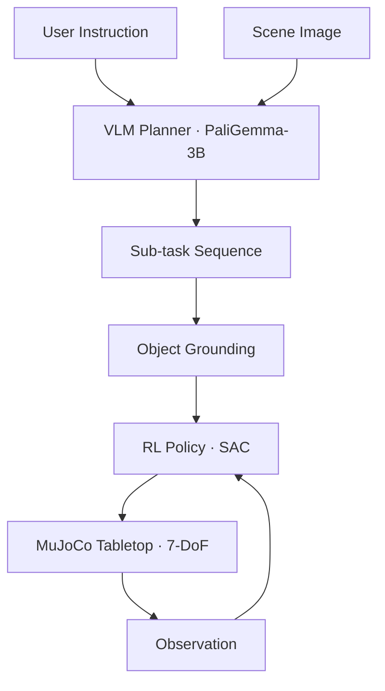

# RoboLLM — Language-Grounded Robotic Manipulation

**LLM × Robotics × GPU Compute**


[](LICENSE)

> A robotics research prototype for language planning, object grounding and
> motor control in MuJoCo, with CPU baselines and explicit evaluation limits.

---

## Overview

RoboLLM explores a hierarchy in which a user instruction (e.g., "stack the red
block on the blue one") becomes sub-tasks executed by motor policies. The
implemented test pipeline uses a rule-based `MockVLM`, privileged simulator
grounding and scripted controllers. SAC training code and an optional real VLM
wrapper are present; successful learned end-to-end manipulation is not established.

SayCan, Code as Policies and RT-2 motivate the intended architecture. A single
T4 GPU is a proposed training target, not a verified end-to-end resource budget.

## Why This Project Exists

Language-grounded manipulation connects three foundational areas:

- **Planning** — test decomposition and grounding before evaluating a learned VLM
- **RL for control** — investigate SAC with shaped rewards and primitive tasks
- **Hierarchical execution** — study the interfaces and failure modes between components
- **Evaluation** — retain seeds and raw outcomes; report Wilson interval endpoints

## Intended Architecture


```mermaid
flowchart TB
  Inst["User Instruction"] --> VLM["VLM Planner · PaliGemma-3B"]
  Scene["Scene Image"] --> VLM
  VLM --> Plan["Sub-task Sequence"]
  Plan --> Ground["Object Grounding"]
  Ground --> Policy["RL Policy · SAC"]
  Policy --> Env["MuJoCo Tabletop · 7-DoF"]
  Env --> Obs["Observation"]
  Obs --> Policy
```

## Tasks

| Level | Description | Objects | Success Metric |
|-------|-------------|---------|----------------|
| **L1** | Pick and place | 1 | Object at target ± 2cm |
| **L2** | Color pick | 3 | Correct object at target |
| **L3** | Stack | 2–3 | Stable stack, correct order |
| **L4** | Sort | 4–6 | All in correct bins |
| **L5** | Language | 3+ | All sub-tasks completed |

## Historical Baseline Results

The [archived benchmark](evaluation/results/benchmark_results.json) records
100 episodes per configuration and a 200-step limit on 22 February 2026. Its
runner used a base environment seed of 42 but did not seed random actions;
runtime/code provenance and raw episodes were not recorded. These are archived
observations, not a reproduction from the current evaluator. Intervals below
are corrected Wilson endpoints computed from the recorded counts.

| Task | Random success (95% CI) | Scripted success (95% CI) |
|------|-------------------------|---------------------------|
| L1 Pick & Place | 0/100 · 0% [0%, 3.70%] | 0/100 · 0% [0%, 3.70%] |
| MoveTo | 0/100 · 0% [0%, 3.70%] | 20/100 · 20% [13.34%, 28.88%] |
| L2 Color Pick | 0/100 · 0% [0%, 3.70%] | — |
| L3 Stack | 0/100 · 0% [0%, 3.70%] | — |
| L4 Sort | 0/100 · 0% [0%, 3.70%] | — |
| L5 Language | 4/100 · 4% [1.57%, 9.84%] | — |

L5 checks final geometric predicates that may already hold at reset; these
results do not demonstrate language understanding. Negative shaped returns
are not meaningful multiplicative performance gains. See the
[archive notes](evaluation/results/README.md) and
[reproduction and evaluation protocol](evaluation/README.md).

### Planner and Grounding Scope

Planner tests exercise keyword rules in `MockVLM`; grounding tests exercise
`SimGrounder` using simulator object labels and poses. These are software
checks, not held-out VLM or visual-grounding accuracy measurements. Visual
DINOv2 grounding remains unimplemented. The executor currently dispatches
`move_to`, `pick` and `place` with scripted policies; successful multi-object
instruction following remains unvalidated.

## Quick Start

```bash
git clone https://github.com/ajliouat/robollm.git && cd robollm
python -m venv .venv && source .venv/bin/activate
pip install -e ".[dev]"
pytest tests/ -v --timeout=120
```

## Project Structure

```
robollm/
├── envs/                        # MuJoCo environments (L1–L5)
│   ├── tabletop.py              # Base tabletop (29D obs)
│   ├── pick_place.py            # L1 · single object
│   ├── color_pick.py            # L2 · color-conditioned
│   ├── stack.py                 # L3 · stacking
│   ├── sort.py                  # L4 · sorting
│   └── complex_language.py      # L5 · multi-step
├── planner/                     # VLM task decomposition
│   ├── vlm_wrapper.py           # VLMBase / MockVLM / TransformersVLM
│   ├── task_parser.py           # SubTask/TaskPlan validation
│   └── grounder.py              # SimGrounder (visual grounding planned)
├── policies/                    # RL + scripted policies
│   ├── sac.py                   # SAC agent
│   └── scripted.py              # Scripted baselines
├── training/                    # Training loops + replay buffer
│   ├── train.py                 # Generic SAC training loop
│   ├── train_all.py             # Unified multi-primitive trainer
│   └── run_aws.sh               # AWS T4 training script
├── evaluation/                  # Benchmark suite + video recorder
│   └── benchmark.py             # SAC checkpoint evaluation support
└── tests/                       # Environment, policy, planner and evaluation tests
```

## Models

| Component | Model | Size | Quantization |
|-----------|-------|------|--------------|
| Optional VLM wrapper (not benchmarked) | PaliGemma-3B | 3B | Optional bitsandbytes 4-bit |
| RL Policy | MLP Actor-Critic | ~200K | fp32 |

## References

- [SayCan (Ahn et al., 2022)](https://say-can.github.io/)
- [RT-2 (Brohan et al., 2023)](https://robotics-transformer2.github.io/)
- [Code as Policies (Liang et al., 2023)](https://code-as-policies.github.io/)
- [MuJoCo](https://mujoco.org/)

## License

Apache 2.0 — see [LICENSE](LICENSE).
